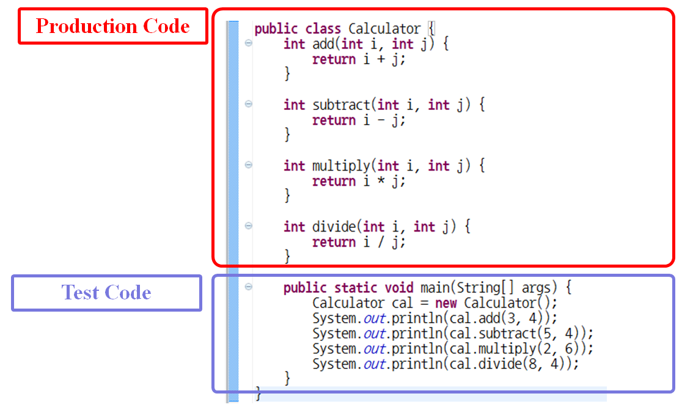

# 📖 단위테스트란?

## main method

#### main method의 용도

- 프로그램을 시작
- 구현한 프로그램을 테스트

> 이 단락은 main method를 테스트 용도로 사용하는 경우에 대해 다루고 있다.

#### 맛보기 프로그램 구현

- 사칙연산이 가능한 계산기
  - 덧셈(add)
  - 뺄셈(subtract)
  - 곱셈(multiply)
  - 나눗셈(divide)
- 위 4개의 기능을 구현하고 main method를 활용해 테스트한다.



- 위 그림을 통해 확인할 수 있듯이 **프로덕션 코드(Production Code)** 프로그램 구현을 담당하는 부분으로 사용자가 실제로 사용하는 소스 코드를 의미한다.
- **테스트 코드(test code)** 는 프로덕션 코드가 정상적으로 동작하는지를 확인하는 코드이다.

#### main method 테스트 문제점

- Production code와 Test Code가 클래스 하나에 존재한다. 클래스 크기가 커짐. 복잡도 증가함.
- Test Code가 실 서비스에 같이 배포됨.
- main method 하나에서 여러 개의 기능을 테스트 함. 복잡도 증가.
- method 이름을 통해 어떤 부분을 테스트하는지에 대한 의도를 드러내기 힘듦.
- 테스트 결과를 사람이 수동으로 확인

## JUnit

- main method를 활용해 테스트할 때 발생하는 문제점을 해결하기 위해 등장한 도구가 [JUnit](http://junit.org/)이다.

#### JUnit 5.x 버전

- 애노테이션(Annotation)을 활용해 테스트 코드 구현
  - @Test
  - @BeforeEach, @AfterEach
  - Assertions 클래스의 static assert method를 활용해 테스트 결과 검증

```java
import org.junit.jupiter.api.AfterEach;
import org.junit.jupiter.api.BeforeEach;
import org.junit.jupiter.api.Test;

import static org.junit.jupiter.api.Assertions.assertEquals;

public class CalculatorTest {
    Calculator cal;

    @BeforeEach
    public void setUp()  {
        cal = new Calculator();
    }

    @Test
    public void 덧셈()  {
        assertEquals(7, cal.add(3, 4));
    }

    @Test
    public void 뺄셈()  {
        assertEquals(1, cal.subtract(5,  4));
    }

    @Test
    public void 곱셉()  {
        assertEquals(6, cal.multiply(2, 3));
    }

    @Test
    public void 나눗셈()  {
        assertEquals(2, cal.divide(8, 4));
    }

    @AfterEach
    public void tearDown() {
        cal = null;
    }
}
```

#### JUnit 4.x 버전

- 애노테이션(Annotation)을 활용해 테스트 코드 구현하는 방법은 JUnit 5.x와 같음
- 애노테이션의 패키지 위치와 이름만 다름. 다른 부분은 5.x와 같음
  - @org.junit.Test
  - @org.junit.Before, @org.junit.After
  - Assert 클래스의 static assert method를 활용해 테스트 결과 검증

#### method 실행 순서

- 다음과 같은 JUnit 테스트를 실행할 경우 실행 순서는 어떻게 될까?

```java
public class CalculatorTest {
    @Before
    public void setup() {
      System.out.println("setup");
    }
    
    @Test
    public void test1() throws Exception {
      System.out.println("test1");		
    }
    
    @Test
    public void test2() throws Exception {
      System.out.println("test2");		
    }
    
    @After
    public void teardown() {
      System.out.println("teardown");		
    }
}
```

> before -> 1 -> after -> before -> 2 -> after


# 의식적인 연습을 하라

## 의식적인 연습의 7가지 원칙

1. 효과적인 훈련기법이 수립 되어 있는 기술 연마 
2. 개인의 컴포트존을 벗어난 지점에서 진행, 자신의 현재 능력을 살짝 넘어가는 작업을 지속적으로 시도
3. 명확하고 구체적인 목표를 가지고 진행
4. 신중하고 계획적이다. 즉, 개인이 온전히 집중하고 '의식적'으로 행동 할 것 을 요구
5. 피드백과 피드백에 따른 행동 변경을 수반 
6. 효과적인 심적 표상을 만들어 내는 한편으로 심적 표상에 의존 
7. 기존에 습득한 기술의 특정 부분을 집중적으로 개선함으로써 발전시키고, 수정하는 과정을 수반

### ***TDD, 리팩토링 == 운동***

### ***평생동안 연습하겠다는 마음가짐으로 시작***


## 1. 단위테스트

> 내가 사용하는 API 사용법을 익히기 위한 학습 테스트에서 시작

- 자바 String 클래스의 다양한 메소드(함수) 사용법
- 자바 ArrayList에 데이터를 추가, 수정, 삭제하는 방법

```java
import org.junit.Test;
import static org.assertj.core.api.Assertions.assertThat;

public class StringTest {
    
 @Test
 public void split() {
 	String[] values = "1".split(",");
 	assertThat(values).contains("1");
 	values = "1,2".split(",");
 	assertThat(values).containsExactly("1", "2");
 }
    
 @Test
 public void substring() {
 	String input = "(1,2)";
 	String result = input.substring(1, input.length() - 1);
 	assertThat(result).isEqualTo("1,2");
 }
}
```

```java
import org.junit.Test;
import java.util.ArrayList;
import static org.assertj.core.api.Assertions.assertThat;

public class CollectionTest {
    
 @Test
 public void arrayList() {
     ArrayList<String> values = new ArrayList<>();
     values.add("first");
     values.add("second");
     assertThat(values.add("third")).isTrue();
     assertThat(values.size()).isEqualTo(3);
     assertThat(values.get(0)).isEqualTo("first");
     assertThat(values.contains("first")).isTrue();
     assertThat(values.remove(0)).isEqualTo("first");
     assertThat(values.size()).isEqualTo(2);
     }
} 
```


### 단위 테스트 연습

- 내가 구현하는 메소드(함수)중 Input과 Output이 명확한 클래스 메소드(보통Util성격의메소드)에 대한 단위 테스트 연습
- 알고리즘을 학습 한다면 알고리즘 구현에 대한 검증을 단위 테스트로 한다. 알고리즘은 Input, Output이 명확하기 때문에 연습하기 좋다.