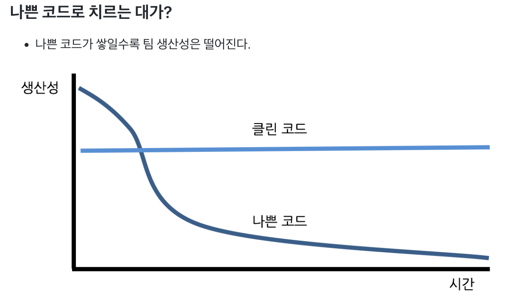
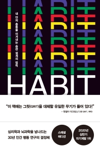

# TDD Coding with Clean Code

> [자바 플레이그라운드 with TDD, 클린코드 2021](https://edu.nextstep.camp/s/RFY359FE) 강의를 들으며 공부한 내용 기록.

## 학습 목표

- GitHub을 활용해 미션 기반으로 학습하는 경험을 한다.
- 컨벤션을 지키고, 읽기 좋은 코드 구현에 대한 필요성을 느끼고, 구현하는 경험을 한다.
- 테스트 기반으로 리팩터링을 통해 점진적으로 클린코드를 구현하는 경험을 한다.

플레이그라운드 과정의 학습 목표를 달성하기 위함인가?

**프로그래밍 자체가 얼마나 재미있는 활동인지 경험**하고,
**효과적으로 프로그래밍을 학습하는 방법을 경험**하고,
**프로그래머로 어떻게 성장하고, 어떻게 살아갈 것인지** 같이 고민하는 시간으로 만들기 위함이다.

# 📖 객체 지향 생활 체조 원칙

> 어떻게 해야 "Clean"한 코딩을 할 수 있는지 구체적인 가이드를 제공한다. 코딩이 끝나면 잘 지켜졌는지 체크해보고 리팩토링 하자.

1. 한 메서드에 오직 한 단계의 들여쓰기만 한다.
2. else 예약어를 쓰지 않는다.
3. 모든 원시 값과 문자열을 포장한다.
4. 한 줄에 점을 하나만 찍는다.
5. 줄여 쓰지 않는다(축약 금지).
6. 모든 엔티티를 작게 유지한다.
7. 3개 이상의 인스턴스 변수를 가진 클래스를 쓰지 않는다.
8. 일급 컬렉션을 쓴다.
9. getter/setter/프로퍼티를 쓰지 않는다.

## 왜 객체 지향 생활 체조 원칙인가?

객체 지향 설계와 구현은 수학 공식을 외워서 문제를 푸는 것과 달리 이론을 안다고 해도 이 이론을 설계와 구현에 녹여내려면 지속적인 수련이 필요한 영역이다. 여기서 수련이라는 의미는 누구나 야구공을 던지는 이론은 다 알고 있지만, 이론을 안다고 누구나 다 프로선수처럼 공을 던질 순 없고 지속적인 훈련(수련)을 통해서만 가능하다.

많은 개발자가 지속적인 수련이 중요하다는 것은 알기 때문에 객체 지향 설계와 구현 연습에 도전한다. 하지만 객체 지향 설계를 다루고 있는 책 대부분이 추상적인 이론을 다루고 있어서 초보 개발자는 몇 번 도전 후에 포기하는 상황이 발생한다. 특히 어려운 점은 소스 코드 중 문제가 있는 부분을 찾는 것이다. 어떻게 리팩터링할 것인지는 그다음 이슈이다.

개선할 부분을 찾지도 못하는 개발자들에게 아무리 객체 지향 설계와 구현과 관련한 이론을 제시해도 무용지물이다.

객체 지향 생활 체조 원칙은 추상적인 가이드가 아니라 구체적인 가이드를 제시하고 있다. 따라서 초보 개발자도 코드 중에서 리팩터링할 부분(코드 스멜)이 있는 코드를 쉽게 찾을 수 있으며, 도전해 볼 수 있다.

예를 들어 "한 메서드에 오직 한 단계의 들여쓰기만 한다."라는 정말 구체적이다. 코드 중 들여쓰기가 2 이상인 코드가 있다면 그 부분을 어떻게 리팩터링할 것인지 고민하면 된다.

이처럼 구체적인 가이드를 통해 꾸준히 수련하다 보면 어느 순간 객체 지향 설계와 관련한 추상적인 이론들이 이해되는 시점이 찾아온다.

## 클린코드는 왜 필요한가?

- 우리 모두는 쓰레기 코드를 보며 나중에 손보겠다고 생각한다. -> "나중은 결코 오지 않는다" : 르블랑의 법칙
  - 매우 공감한다...
- 

- 생산성이 0에 수렴해 가는 시점에 재설계를 요구한다. 
- 어쩔수 없이 허락하지만 새로운 프로젝트도 해야되고..등등 바쁘다
- 악순환이된다...
- -> 그냥 처음부터 잘쓰자

# 미션을 슬기롭게 소화하는 방법

## 변화를 위해 의지력보다는 환경(상황)이 더 중요

## 연습할 시간 확보하기 위해 환경을 바꿔라.

- 야근을 하지 않고 싶다.
  - 교육에 집중하기 위해 배려해 달라고 요청한다.
  - 그럼에도 불구하고 야근에 대한 압박이 있다면 그냥 회사를 그만둔다.
- 애인 또는 친구들과의 관계를 끊고 싶다.
  - 퇴근 후 카페로 출근한다.
- TV를 보지 않고 싶다.
  - 집중 학습 기간 동안 TV를 창고에 처박아 둔다. 리모콘을 버린 후 학습 기간이 끝난 후 다시 산다.
- 스마트폰 보는 시간을 줄이고 싶다.
  - 집에 도착하면 스마트폰을 꺼놓는다. 리뷰 요청을 보낸 후 켠다.

여러분의 의지력을 믿지 마라. 절대로
**환경을 바꿔라.**

## 매일 미션 진행하기

- 한번에 모두 구현하기 보다 **매일 일정한 시간 투자하는 것이 정말 중요**함.
- **최소 하루에 2시간 이상 투자**할 것을 추천

## 가진 것을 비우기

- 요구사항 규모에 비해 극단적인 리팩토링을 요구하는 경우가 많다.
- 거부감이 들 수 있지만 일단 적용해 보고, 적용하기 전과 후의 코드를 분석해 본다.
- **자신이 가진 것을 비울 때 가장 많은 것을 배울 수 있다.**

## 정답을 찾기 위해 집착하지 마라.

- 미션을 진행하는데 정답은 없다.
- 정답을 찾으려는 노력이 오히려 학습을 방해한다.
- 현재 상황에서 최선의 답을 끊임없이 찾으려고 노력한다.